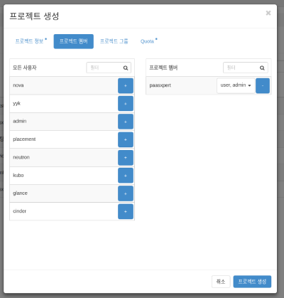
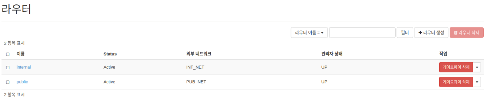
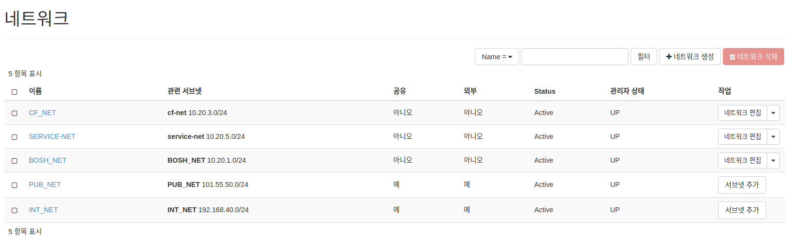
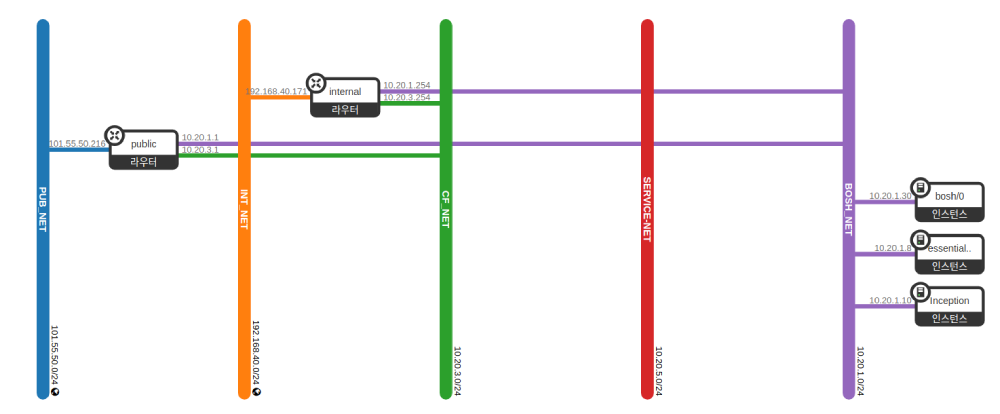
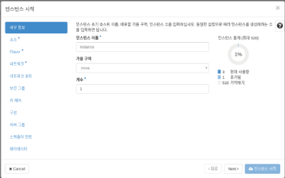

# Openstack Bosh-lite & CF 설치 가이드

### Table of Contents
1. [환경 구성 및 릴리즈 정보](#1)
    * 1.1. [설치 전 환경 구성](#1.1)
    * 1.2. [BOSH Releases](#1.2)
    * 1.3. [CF Releases](#1.3)
    * 1.4. [CF BuildPacks](#1.4)
    * 1.5. [Prepare an OpenStack Environment](#1.5)

2. [관련 CLI 설치](#2)
    * 2.1. [Install The BOSH CLI](#2.1)
    * 2.2. [Install The CF CLI](#2.2)
    * 2.3. [Install The CF-Uaac CLI](#2.3)

3. [BOSH-LITE 설치](#3)
    * 3.1. [BOSH Deploy](#3.1)
    * 3.2. [CF Deploy](#3.2)

## Step 1: Prepare an OpenStack environment
# 
 1. Installing the CLI
본 가이드는 Openstack 클라우드 환경으로 Cloud Foundry의 Document를 참고로 작성하였다.
# 
1.1. 환경 구성
<table>
  <tr>
    <td>Operating System</td>
    <td>Ubuntu</td>
  </tr>
  <tr>
    <td>Iaas</td>
    <td>Openstack</td>
  </tr>
</table>

# 
1.2. Bosh Releases
<table>
  <tr>
    <th>릴리즈 명</th>
    <th>버전</th>
  </tr>
  <tr>
    <td>Bosh</td>
    <td>268.2.0</td>
  </tr>
  <tr>
    <td>bpm</td>
    <td>0.12.3</td>
  </tr>
  <tr>
    <td>bosh-openstack-cpi</td>
    <td>39</td>
  </tr>
  <tr>
    <td>stemcell</td>
    <td>bosh-openstack-kvm-ubuntu-xenial-go_agent?v=97.12</td>
  </tr>
</table>

# 
1.3. CF Releases
<table>
  <tr>
    <th>릴리즈 명</th>
    <th>버전</th>
  </tr>
  <tr>
    <td>cf-deployment(git)</td><td>v4.0.0</td>
  </tr>
  <tr>
    <td>cflinuxfs2-release</td><td>1.234.0</td>
  </tr>
  <tr>
    <td>diego-release</td><td>2.16.0</td>
  </tr>
  <tr>
    <td>garden-runc-release</td><td>1.16.3</td>
  </tr>
  <tr>
    <td>uaa-release</td><td>60.2</td>
  </tr>
</table>

<table>
  <tr>
    <th>스템셀</th>
    <th>버전</th>
  </tr>
  <tr>
    <td>ubuntu-trusty</td>
    <td>3586.40</td>
  </tr>
</table>

# 
1.4. CF BuildPacks
<table>
  <tr>
    <th>빌드팩 명</th>
    <th>버전</th>
  </tr>
  <tr>
    <td>binary-buildpack-release</td><td>1.0.21</td>
  </tr>
  <tr>
    <td>go-buildpack-release</td><td>1.8.26</td>
  </tr>
  <tr>
    <td>java-buildpack-release</td><td>4.15</td>
  </tr>
  <tr>
    <td>nodejs-buildpack-release</td><td>1.6.30</td>
  </tr>
  <tr>
    <td>php-buildpack-release</td><td>4.3.59</td>
  </tr>
  <tr>
    <td>python-buildpack-release</td><td>1.6.20</td>
  </tr>
  <tr>
    <td>ruby-buildpack-release</td><td>1.7.22</td>
  </tr>
  <tr>
    <td>staticfile-buildpack-release</td><td>1.4.31</td>
  </tr>
  <tr>
    <td>dotnet-core-buildpack-release</td><td>2.1.4</td>
  </tr>
</table>

# 
1.5. Prepare an Openstack Environment

### 1.5.1. 사용자 및 프로젝트 생성
 - 관리자 권한이 있는 사용자로 오픈스택 대시보스 화면에 로그인한다. 
 - 오픈스택 대시보드 화면에서 사용자를 생성한다.
 - 오픈스택 대시보드 화면에서 프로젝트를 생성한다.  
   이 때, 프로젝트 멤버에 권한을 <u>user, admin</u> 으로 준다.
  
     

### 1.5.2. 네트워크 구성 
 - internal/public 라우터를 생성한다.
   
      
      
 - BOSH_NET/CF_NET/SERVICE_NET 네트워크를 생성한다. 
   (INT_NET, PUB_NET은 기본으로 생성되어 있다.)
   
      
      
 - 각각 internal, public 라우터에 네트워크 인터페이스를 생성한다.
 
      
      
### 1.5.3. 보안 그룹 및 규칙 생성 
<table>
  <tr>
    <th>Type</th>
    <th>Protocol</th>
    <th>Port Range</th>
  </tr>
  <tr>
    <td>TCP</td>
    <td>22</td>
    <td>0.0.0.0/0</td>
  </tr>
  <tr>
    <td>TCP</td>
    <td>6868</td>
    <td>0.0.0.0/0</td>
  </tr>
  <tr>
    <td>TCP</td>
    <td>25555</td>
    <td>IP you run bosh CLI from</td>
  </tr>
  <tr>
    <td>TCP</td>
    <td>8443</td>
    <td>0.0.0.0/0</td>
  </tr>
  <tr>
    <td>TCP</td>
    <td>443</td>
    <td>0.0.0.0/0</td>
  </tr>
  <tr>
    <td>TCP</td>
    <td>8844</td>
    <td>0.0.0.0/0</td>
  </tr>
  <tr>
    <td>TCP</td>
    <td>4222</td>
    <td>0.0.0.0/0</td>
  </tr>
  <tr>
    <td>TCP</td>
    <td>25250</td>
    <td>0.0.0.0/0</td>
  </tr>
  <tr>
    <td>TCP</td>
    <td>25777</td>
    <td>0.0.0.0/0</td>
  </tr>
  <tr>
    <td>ICMP</td>
    <td>1-65535</td>
    <td>0.0.0.0/0</td>
  </tr>
  <tr>
    <td>TCP</td>
    <td>1-65535</td>
    <td>bosh-security</td>
  </tr>
</table>

### 1.5.4. Keypair 생성
 - 메뉴 프로젝트 > Compute > Key Pair 화면에서 Key Pair 를 생성한다.
 
     

 - 로컬에 다운받은 Key를 .ssh 디렉토리에 옮기고 권한을 수정한다.
    
         $ mv ~/Downloads/bosh.pem ~/.ssh/.
         $ chmod 600 ~/.ssh/bosh.pem  
     
     
# 
Step 2: Prepare to install cli for BOSH & CF
# 
 2.1. BOSH CLI 설치 
 1. Navigate to the BOSH CLI GitHub release page and choose the correct download for your operating system.
 2. Make the bosh binary executable and move the binary to your PATH: 	
    
         $ chmod +x ./bosh
 	     $ sudo mv ./bosh /usr/local/bin/bosh

 3. You should now be able to use bosh. Verify by querying the CLI for its version:
 
     	$ bosh -v
	    version 5.3.1-8366c6fd-2018-09-25T18:25:51Z
 	    Succeeded
 	    
 4. If you are running on Ubuntu, ensure the following packages are installed on your system:
 
        sudo apt-get install -y build-essential zlibc zlib1g-dev ruby ruby-dev openssl libxslt-dev libxml2-dev libssl-dev libreadline6 libreadline6-dev libyaml-dev libsqlite3-dev sqlite3
        
        
> 참고 자료: https://bosh.io/docs/cli-v2-install/
        
# 
 2.2. CF CLI 설치 

### Linux Installation
 For Debian and Ubuntu-based Linux distributions, perform the following steps:
  1. Add the Cloud Foundry Foundation public key and package repository to your system:
 
         $ wget -q -O - https://packages.cloudfoundry.org/debian/cli.cloudfoundry.org.key | sudo apt-key add -
        
         $ echo "deb https://packages.cloudfoundry.org/debian stable main" | sudo tee /etc/apt/sources.list.d/cloudfoundry-cli.list
        
 2. Update your local package index:
       
        $ sudo apt-get update
 3. Install the cf CLI:
 
        $ sudo apt-get install cf-cli

> 참고자료 : https://docs.cloudfoundry.org/cf-cli/install-go-cli.html

# 
 2.3. CF-Uaac CLI 설치 
### 2.3.1. rvm 설치
uaac를 설치하기 전에 rvm이 설치되어있는지 확인한다.

    $ gpg --keyserver hkp://keys.gnupg.net --recv-keys 409B6B1796C275462A1703113804BB82D39DC0E3
    $ curl -sSL https://get.rvm.io | bash -s stable --ruby
    $ source ~/.rvm/scripts/rvm
    
    $ rvm install ruby-2.3.0

### 2.3.2. uaac 설치

    $ gem install cf-uaac
    
> 참고 자료: https://github.com/cloudfoundry/cf-uaac.git

# 
 Step 3: Deploy
# 
 3.1. Bosh Deploy

 해당 설치 가이드는 Virtual Box 설치 없이 OpenStack VM(Virtual Machine) 에서 Bosh-lite 을 설치합니다.
VirtualBox 를 통해 빠르게 bosh-lite 을 설치하실 경우는 https://bosh.io/docs/quick-start/ 가이드를 통해 설치하세요. 

### 1. 인스턴스 생성

 - 메뉴 프로젝트 > Compute > 인스턴스 화면에서 bosh lite 및 cf를 설치 할 인스턴스를 생성한다.

     
     
 - 생성한 인스턴스에 접속하여 git에서 bosh-deployment를 가져온다.
     
          $ ssh ubuntu@{instance floating ip}
          $ mkdir -p workspace/bosh
          $ git clone https://github.com/cloudfoundry/bosh-deployment.git
      
 - route 추가
   
          $ sudo route add -net 192.168.40.0 gw 10.20.1.254
       
 - openstack cpi 정보에 대한 vars.yml file 생성
       
        ---
        director_name: bosh
        internal_cidr: 10.20.1.0/24
        internal_gw: 10.20.1.1
        internal_ip: 10.20.1.30
        external_ip: { 할당받은 Floating IP }
        auth_url: { Compute > API 엑세스 > Identity }
        az: nova
        default_key_name: bosh
        default_security_groups: [bosh-security]
        net_id: { openstack 네트워크 ID }
        openstack_domain: { openstack 도메인(기본값 : default) }
        openstack_username: { openstack 사용자 명 }
        openstack_password: { openstack 프로젝트 패스워드 }
        openstack_project: { openstack 프로젝트 명 }
        region: { openstack region (기본값: RegionOne)  }
 
 - Deploy the Director
      
       bosh create-env bosh-deployment/bosh.yml \
        --vars-store=./creds.yml \
        --vars-file=./vars.yml \
        --var-file=private_key=/home/ubuntu/.ssh/bosh.pem \
        --state=./state.json \
        -o bosh-deployment/openstack/cpi.yml \
        -o bosh-deployment/bosh-lite.yml \
        -o bosh-deployment/bosh-lite-runc.yml \
        -o bosh-deployment/uaa.yml \
        -o bosh-deployment/credhub.yml \
        -o bosh-deployment/jumpbox-user.yml
  
  - 오픈스택 대시보드에 VM(bosh/0)이 생성되어 있는 것을 확인할 수 있다.
  
  - Connect to the Director
    
            # Configure local alias
            bosh alias-env bosh -e  10.20.1.30 --ca-cert <(bosh int /home/ubuntu/workspace/bosh/creds.yml --path /director_ssl/ca)
         
            # Log in to the Director
            export BOSH_CLIENT=admin
            export BOSH_CLIENT_SECRET=`bosh int /home/ubuntu/workspace/bosh/creds.yml --path /admin_password`
        
            # Query the Director for more info
            bosh -e bosh env
         
  - UAA Login
        
             $ bosh -e bosh login
              > Email (): admin
              > Password (): {bosh password}
          
             Successfully authenticated with UAA
     
  - bosh Director ssh 접속
       
              $ bosh int creds.yml --path /jumpbox_ssh/private_key > jumpbox.key
              $ chmod 600 jumpbox.key
              $ ssh jumpbox@10.20.1.30 -i jumpbox.key
 

  - bosh Director VM에 route 추가
    
              $ sudo route add -net 192.168.40.0 gw 10.20.1.254
     
  
# 
 3.2. CF Deploy
 
 - cf-deployment clone(branch v4.0.0)
        
        $ mkdir -p ~workspace/cf
        $ cd ~/workspace/cf
        $ git clone https://github.com/cloudfoundry/cf-deployment.git
        $ git checkout -v4.0.0

 - 스템셀 업로드(ubuntu trusty 3586.40) 
   ** 이 때 bosh-lite 주의사항은 Openstack 스템셀이 아닌 Warden (BOSH Lite) 스템셀을 올린다.
    
        $ bosh -e bosh upload-stemcell --sha1 9aca8b9484e9ca7095077d51d6af129698c9fab1 \
                https://bosh.io/d/stemcells/bosh-warden-boshlite-ubuntu-trusty-go_agent?v=3586.40
  
 - openstack-cloud-config.yml 생성
   
        $ vi ~/workspace/cf/cf-deployment/iaas-support/openstack/openstack-cloud-cloud.yml
         
     
        vm_types:
        - name: minimal
          cloud_properties:
            instance_type: minimal
        - name: small
          cloud_properties:
            instance_type: small
        - name: small-highmem
          cloud_properties:
            instance_type: small-highmem
        - name: small-50GB-ephemeral-disk
          cloud_properties:
            instance_type: small-50GB-ephemeral-disk
        - name: small-highmem-100GB-ephemeral-disk
          cloud_properties:
            instance_type: small-highmem-100GB-ephemeral-disk
        
        disk_types:
        - name: 5GB
          disk_size: 5000
        - name: 10GB
          disk_size: 10000
        - name: 100GB
          disk_size: 100000
        
        vm_extensions:
        - name: 5GB_ephemeral_disk
        - name: 10GB_ephemeral_disk
        - name: 50GB_ephemeral_disk
        - name: 100GB_ephemeral_disk
        - name: 500GB_ephemeral_disk
        - name: 1TB_ephemeral_disk
        - cloud_properties: {}
          name: cf-haproxy-network-properties
        - name: ssh-proxy-and-router-lb
        - name: cf-router-network-properties
          cloud_properties:
        - name: diego-ssh-proxy-network-properties
        - name: cf-tcp-router-network-properties
        
        azs:
        - name: z1
        - name: z2
        - name: z3
        
        networks:
        - name: floating
          type: vip
        - name: default
          type: manual
          subnets:
          - azs: [z1, z2, z3]
            range: 10.20.3.0/24
            reserved: [10.20.3.2 - 10.20.3.10]
            static: [10.20.3.30 - 10.20.3.250]
            gateway: 10.20.3.1
            cloud_properties:
              net_id: 81f3183b-73bd-4bc6-96a4-700c7383b779
              security_groups: [bosh-security]
        
        compilation:
          workers: 5
          reuse_compilation_vms: true
          vm_type: minimal
          network: default
          az: z1

 
  
 - update-cloud-config 명령어 수행
    
            $ bosh -e bosh ucc ~/workspace/cf/cf-deployment/iaas-support/openstack/openstack-cloud-cloud.yml
     
 - cf deploy
 
        $ cd ~/workspace/cf
        
        $ bosh -e bosh -d cf deploy cf-deployment/cf-deployment.yml \
          --vars-store env-repo/deployment-vars.yml \
          -v system_domain=msxpert.co.kr \
          -v haproxy_public_network_name=floating \
          -v haproxy_public_ip=101.55.50.200 \
          -o cf-deployment/operations/bosh-lite.yml \
          -o cf-deployment/operations/use-haproxy.yml \
          -o cf-deployment/operations/use-haproxy-public-network.yml \
          -o cf-deployment/operations/use-postgres.yml
  
 - CF 로그인     
 
         $ cf api https://api.msxpert.co.kr --skip-ssl-validation
         $ export CF_ADMIN_PASSWORD={cf password}
         $ cf auth admin $CF_ADMIN_PASSWORD    
     
     
     