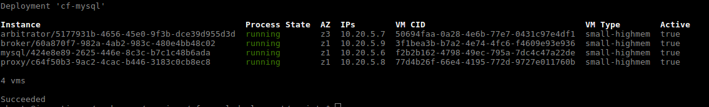

# MYSQL Installation Guid on BOSH-LITE 

### Table of Contents
1. [Prerequisites](#1)
2. [Deploy](#2)
3. [Security Groups](#3)

# 
1. Prerequisites
- A deployment of [BOSH](../README.md)
- Routing release v0.145.0 or later is required to register the proxy and broker routes with Cloud Foundry:

- 설치 정보
#### Releases
<table>
  <tr>
    <th>릴리즈 명</th>
    <th>버전 </th>
  </tr>
  <tr>
    <td>mysql</td>
    <td>36.14.0</td>
  </tr>
  <tr>
    <td>bpm</td>
    <td>latest</td>
  </tr>
</table>

#### Stemcell
<table>
  <tr>
    <th>스템셀 명</th>
    <th>버전</th>
  </tr>
  <tr>
    <td>ubuntu-trusty</td>
    <td>3586.40</td>
  </tr>
</table>

# 
2. Deploy

- cf-mysql-deployment clone
  
        $ git clone https://github.com/cloudfoundry/cf-mysql-deployment.git

- update-cloud-config
      
        $ bosh -e bosh ucc bosh-lite/cloud-config.yml
  
- default-vars.yml 수정
      
         $ vi bosh-lite/default-vars.yml
              
         ---
         cf_mysql_external_host: p-mysql.{domain}
         cf_mysql_host: msxpert.co.kr
         cf_admin_password: {cf admin password}
         cf_api_url: https://api.{domain}
         cf_skip_ssl_validation: true
         proxy_vm_extension: mysql-proxy-lb
  
- scripts/deploy-cf-mysql-to-bosh-lite 수정
    - 해당 스크립트에 --vars-store mysql-vars.yml 내용을 추가한다.
    
             pushd "${root_dir}" > /dev/null
               bosh -e bosh-lite \
                 deploy \
                 "${root_dir}/cf-mysql-deployment.yml" \
                 -o "${root_dir}/operations/bosh-lite.yml" \
                 -o "${root_dir}/operations/latest-versions.yml" \
                 -l "${root_dir}/bosh-lite/default-vars.yml" \
                 --vars-store mysql-vars.yml \
                 --no-redact \
                 "$@"
               
- deploy-cf-mysql-with-broker-to-bosh-lite 스크립트 실행
     
          $ ./deploy-cf-mysql-with-broker-to-bosh-lite
          
          Task 414 | 06:12:39 | Preparing deployment: Preparing deployment (00:00:03)
          Task 414 | 06:12:44 | Preparing package compilation: Finding packages to compile (00:00:00)
          Task 414 | 06:12:45 | Updating instance mysql: mysql/424e8e89-2625-446e-8c3c-b7c1c48b6ada (0) (canary) (00:01:28)
          Task 414 | 06:14:13 | Updating instance arbitrator: arbitrator/5177931b-4656-45e0-9f3b-dce39d955d3d (0) (canary) (00:00:38)
          Task 414 | 06:14:51 | Updating instance proxy: proxy/c64f50b3-9ac2-4cac-b446-3183c0cb8ec8 (0) (canary) (00:00:39)
          Task 414 | 06:15:30 | Updating instance broker: broker/60a870f7-982a-4ab2-983c-480e4bb48c02 (0) (canary) (00:00:44)
          
          Task 414 Started  Wed Nov 28 06:12:39 UTC 2018
          Task 414 Finished Wed Nov 28 06:16:14 UTC 2018
          Task 414 Duration 00:03:35
          Task 414 done
          
          Succeeded
      
      
- cf-mysql vms
      
    

- service-broker 등록
    
        $ cf create-service-broker cf-mysql-broker admin {{service-broker-password}}  https://p-mysql.msxpert.co.kr
      
- 서비스 접근 등록
   
        $ cf enable-service-access p-mysql      

# 
3. Security Groups
기본적으로 응용 프로그램은 사설망의 IP 주소에 연결할 수 없으므로 응용 프로그램이 MySQL 서비스에 연결하지 못합니다. 서비스에 접근하려면 manifest에서 jobs.cf-mysql-broker.mysql_node.host 속성에 대해 구성된 IP의 새 보안 그룹을 만듭니다.

- Add the rule to a file in the following json format; multiple rules are supported.

          $ vi rule.json

          [
            {
              "destination": "10.20.1.1-10.20.1.255",
              "protocol": "all"
            },
            {
              "destination": "10.20.3.1-10.10.3.255",
              "protocol": "all"
            },
            {
              "destination": "10.20.5.1-10.20.5.255",
              "protocol": "all"
            }
          ]
       
- Create a security group from the rule file.
  
        $ cf create-security-group p-mysql rule.json
      
      
- Enable the rule for all apps
      
        $ cf bind-running-security-group p-mysql
